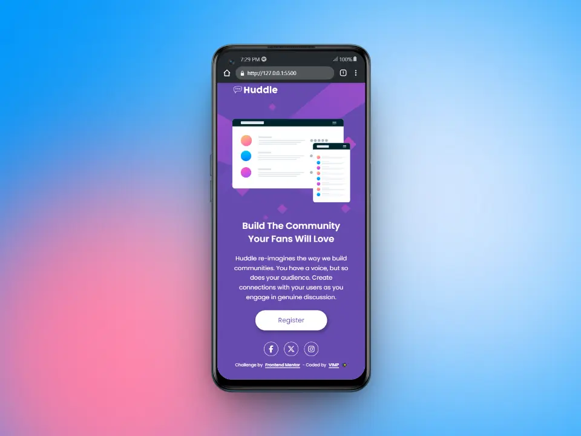
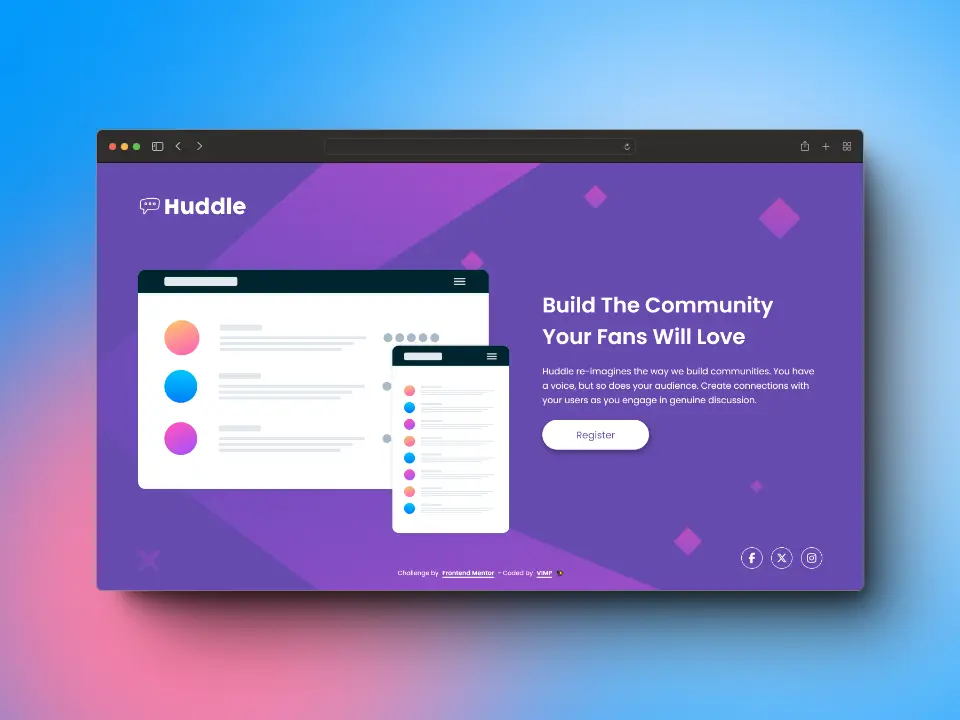

# Frontend Mentor - Huddle landing page with single introductory section solution

This is a solution to the [Huddle landing page with single introductory section challenge on Frontend Mentor](https://www.frontendmentor.io/challenges/huddle-landing-page-with-a-single-introductory-section-B_2Wvxgi0).

Frontend Mentor challenges help you improve your coding skills by building realistic projects.

## Table of contents

- [The challenge](#the-challenge)
- [Screenshot](#screenshot)
- [Links](#links)
- [Built with](#built-with)
- [Useful resources](#useful-resources)
- [Author](#author)

## The challenge

Users should be able to:

🎯 View the optimal layout for the page depending on their device's screen size

🎯 See hover states for all interactive elements on the page

## Screenshot

### 📱 Mobile

### 💻 Desktop

## Links

[Live Site](https://mendez-v.github.io/huddle-introductory-section/) 👀

[Solution in Frontend Mentor](https://www.frontendmentor.io/solutions/huddle-landing-page-with-a-single-introductory-section-7bjF_nFwhT) 👀

[Challenge Repository](https://github.com/mendez-v/frontend-mentor-challenges) 👀

## Built with

📌 Semantic HTML5 markup

📌 CSS custom properties

📌 Flexbox

📌 CSS Grid

📌 Mobile-first workflow

## Useful resources

🔗 Icons - [Fontawesome](https://fontawesome.com/)

🔗 Fonts - [Google fonts](https://fonts.google.com/)

## Author

✨ Frontend Mentor - [@mendez-v](https://www.frontendmentor.io/profile/mendez-v)
